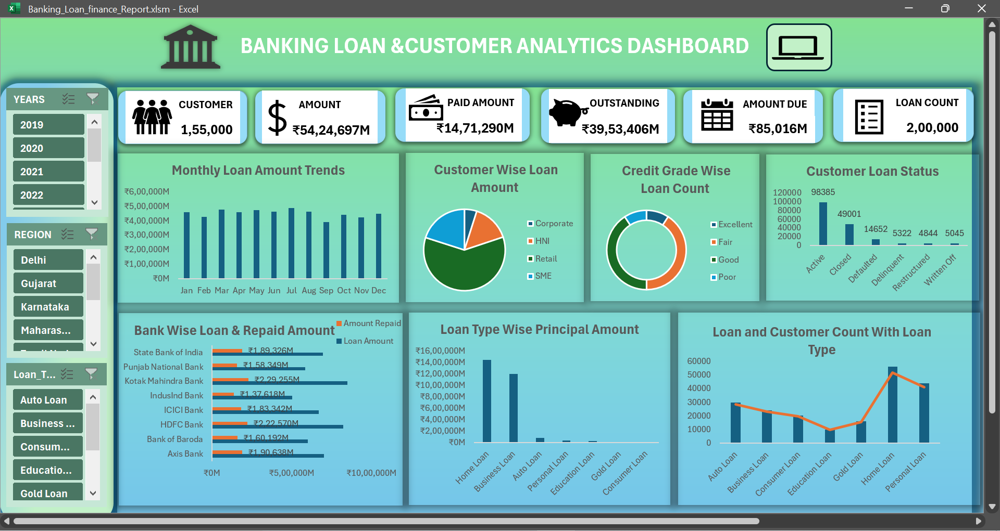

# Banking Loan & Customer Analysis Dashboard

An interactive **Excel Banking Loan & Customer Analysis Dashboard** built to analyze loan performance, customer behavior, repayment activity, credit grades, loan types, regions, banks, and other key banking metrics.

The project uses **Power Query, Pivot Tables, dynamic KPI values, charts, slicers, and VBA-based dashboard view control** to transform raw banking data into an interactive analytical dashboard.

## Dashboard Preview



## Files in This Repository

| File | Description |
|---|---|
| [Banking-Loan-Dashboard.xlsm](Banking-Loan-Dashboard.xlsm) | Complete Excel dashboard with analysis, Pivot Tables, Power Query, KPIs, slicers, and dashboard functionality |
| [Banking-Loan-Dashboard-Datasets.csv](Banking-Loan-Dashboard-Datasets.csv) | Raw banking dataset used for the project |
| [Banking-Loan-Dashboard.png](Banking-Loan-Dashboard.png) | Dashboard screenshot / preview |

---

# Project Workflow

```text
CSV Dataset
     ↓
Power Query
     ↓
Raw Data
     ↓
Data Validation
     ↓
Working Sheet
     ↓
Pivot Table Analysis
     ↓
Dashboard Supporting Pivot Tables
     ↓
Dynamic KPI Value Table
     ↓
Interactive Dashboard
```

---

# Data Preparation

The CSV dataset was imported into Excel using **Power Query**.

The data preparation process included:

- Importing the banking dataset through Power Query
- Maintaining the imported data as raw data
- Validating the banking dataset
- Checking for blank values
- Checking for errors
- Processing the validated data
- Loading the processed data into a separate **Working Sheet**

This created a structured separation between the original imported dataset and the processed data used for analysis.

---

# Pivot Table Analysis

A dedicated **Pivot Table Analysis** sheet was created as the main analytical layer of the project.

Instead of directly building dashboard charts from the raw data, Pivot Tables were used to analyze the dataset from multiple banking and customer perspectives.

This allowed the analysis to move from high-level loan performance to more detailed customer, geographic, banking, credit, and repayment dimensions.

## 1. Bank-wise Analysis

Bank-wise Pivot Tables were used to compare banking activity across different banks.

The analysis includes:

- Loan count
- Customer count
- Total loan amount
- Repaid amount
- Outstanding amount
- Amount due

### Business importance

From a banking perspective, bank-wise analysis helps understand the distribution of lending and repayment activity across institutions.

It can be used to examine:

- Which banks have higher lending volumes
- How much loan value has been repaid
- The level of outstanding exposure
- Differences in repayment activity between banks

This provides a high-level view of lending and recovery patterns.

---

## 2. Region-wise Analysis

The dataset was analyzed geographically using region-level Pivot Tables.

The analysis examines:

- Customer count
- Loan count
- Loan amount
- Repayment amount
- Outstanding amount
- Amount due

### Business importance

Regional analysis helps identify geographical differences in loan activity.

For a bank, this type of analysis can support questions such as:

- Which regions generate higher loan volumes?
- Where is loan exposure concentrated?
- Which regions contribute more to repayment?
- Where are outstanding or due amounts concentrated?

This can help provide a geographical view of the bank's loan portfolio.

---

## 3. Branch-wise Analysis

Branch-level analysis provides a more granular view than regional analysis.

The Pivot Tables examine loan and customer activity at branch level.

### Business importance

Branch-level analysis can help management understand how lending activity is distributed across individual branches.

It can provide visibility into:

- Branch lending volume
- Customer activity
- Loan exposure
- Repayment activity
- Outstanding amounts

This creates a more detailed view of the portfolio than bank or region-level analysis alone.

---

# Customer Analysis

## 4. Customer Segment Analysis

Customer segments were analyzed based on:

- Customer count
- Loan count
- Loan amount

### Business importance

Customer segmentation helps banks understand which customer groups contribute more to the loan portfolio.

It can help answer:

- Which segment has the largest loan exposure?
- Which segment contains more customers?
- Does a particular segment contribute disproportionately to loan value?

This can support customer portfolio analysis and segmentation strategies.

---

## 5. Gender Analysis

The dataset was analyzed by gender to understand differences in:

- Customer count
- Loan count
- Loan amount

### Business importance

Gender-based analysis provides a demographic view of the customer and lending portfolio.

It allows the bank to understand how loan activity is distributed across customer groups and identify differences in borrowing patterns.

---

## 6. Occupation Analysis

Customer occupation was analyzed against loan activity.

The analysis includes:

- Customer count
- Loan count
- Loan amount

### Business importance

Occupation can provide useful context about customer borrowing patterns.

The analysis can help identify:

- Occupations associated with higher loan volumes
- Differences in borrowing levels
- Customer concentration by occupation

This can help banks better understand the composition of their lending portfolio.

---

## 7. Employment Type Analysis

Loan activity was also analyzed according to employment type.

### Business importance

Employment type can be an important customer characteristic when studying lending patterns.

The analysis provides insight into how loan activity varies across different employment categories and helps understand the composition of the customer loan portfolio.

---

# Loan Portfolio Analysis

## 8. Loan Type Analysis

The project analyzes different loan types using:

- Loan count
- Customer count
- Principal amount
- Loan amount

### Business importance

Loan-type analysis allows a bank to understand where its lending portfolio is concentrated.

It helps answer:

- Which loan categories have more customers?
- Which loan categories generate more loans?
- Which loan types have greater principal exposure?
- How is the portfolio distributed across loan products?

---

## 9. Loan Status Analysis

Loan status was analyzed to understand the distribution of loans/customers across different statuses, including active, closed, and other statuses.

### Business importance

Loan status provides an overview of the current state of the loan portfolio.

For a bank, this helps distinguish between:

- Active lending relationships
- Completed/closed loans
- Other portfolio statuses

This provides a clearer picture of the current loan portfolio structure.

---

## 10. Credit Grade Analysis

Credit grades were analyzed against loan count.

### Business importance

Credit-grade analysis helps understand how the loan portfolio is distributed across different credit-quality categories.

It allows the bank to examine:

- Loan concentration by credit grade
- Number of loans associated with different grades
- Distribution of lending activity across credit categories

This can provide useful portfolio-risk context, although the dashboard itself focuses on descriptive analysis rather than calculating a formal credit-risk score.

---

## 11. Due Status Analysis

Due status was analyzed to understand loan repayment conditions and outstanding obligations.

The analysis includes measures such as:

- Amount due
- Repaid amount
- Remaining amount
- Outstanding amount

### Business importance

Due-status analysis provides visibility into repayment obligations and unresolved loan amounts.

For banking analysis, this can help identify where repayment activity differs from the original lending exposure and where outstanding amounts remain.

---

## 12. Collateral-wise Analysis

Collateral information was also analyzed using Pivot Tables.

### Business importance

Collateral-wise analysis provides another dimension for understanding the secured lending portfolio.

It can help examine how loan activity and loan exposure are distributed across different collateral categories.

---

## 13. Monthly Trend Analysis

Monthly loan activity was analyzed to identify changes in loan amounts over time.

### Business importance

Time-based analysis helps a bank understand the movement of lending activity across months.

It can reveal:

- Higher and lower lending periods
- Changes in loan demand over time
- Seasonal or recurring patterns
- Changes in overall lending activity

This provides a time dimension to the otherwise category-based portfolio analysis.

---

# Key Measures Used Throughout the Analysis

The Pivot Tables focus on several core banking measures:

| Measure | Business Meaning |
|---|---|
| **Loan Count** | Number of loans in the portfolio |
| **Customer Count** | Number of customers represented in the analysis |
| **Total Loan Amount** | Overall value of loans issued/represented |
| **Principal Amount** | Principal component of the loan portfolio |
| **Total Interest** | Interest associated with the loans |
| **Repaid Amount** | Amount already repaid |
| **Remaining Amount** | Amount remaining on the loans |
| **Amount Due** | Amount currently due according to the dataset |

Using multiple measures instead of relying only on loan count provides a broader view of portfolio size, repayment activity, and outstanding exposure.

---

# Dashboard

## BANKING LOAN & CUSTOMER ANALYSIS DASHBOARD

The final dashboard brings the major analytical findings into a single interactive view.

The dashboard is designed from a **bank management perspective**, focusing on portfolio size, customer composition, lending activity, repayment, credit distribution, and loan-product analysis.

---

# KPI Section

The dashboard contains six dynamic KPIs:

- Total Customer
- Total Loan Amount
- Paid Amount
- Outstanding Amount
- Amount Due
- Loan Count

A dedicated **Value Table** was created specifically for the KPI values.

The KPI values dynamically respond to the dashboard filters, allowing users to see how the selected year, region, or loan type affects the overall portfolio.

### Business importance

These KPIs provide a quick portfolio-level snapshot before moving into detailed visual analysis.

For example, a bank user can quickly see how the selected filter affects:

- Number of customers
- Lending volume
- Repayment
- Outstanding exposure
- Amount due
- Number of loans

---

# Dashboard Visual Analysis

## 1. Monthly Loan Amount

**Chart:** Column Chart

This visual displays the total loan amount across months.

### What it shows

The chart shows how lending activity changes month by month and highlights periods with relatively higher or lower loan amounts.

### Banking business importance

For a bank, monthly lending trends can provide insight into:

- Changes in loan demand
- High and low lending periods
- Changes in portfolio origination activity
- Potential recurring or seasonal patterns

It gives management a time-based view of lending activity rather than only showing the overall portfolio total.

---

## 2. Customer Segment-wise Loan Amount

**Chart:** Pie Chart

This visual shows how total loan amount is distributed across customer segments.

### What it shows

Each segment represents its share of the overall loan amount.

### Banking business importance

This helps the bank understand where its lending exposure is concentrated from a customer-segment perspective.

It can answer:

- Which customer segment contributes the largest loan amount?
- How concentrated is the loan portfolio across segments?
- Which segments represent a relatively smaller share of lending?

This provides a portfolio-composition perspective for customer segmentation.

---

## 3. Bank-wise Loan Amount & Repaid Amount

**Chart:** Bar Chart

This visual compares **loan amount** and **repaid amount** for each bank.

### What it shows

The chart places lending volume and repayment activity side by side for comparison.

### Banking business importance

For a bank, comparing these two measures provides context about:

- Lending exposure
- Repayment activity
- Differences between banks
- The relationship between loan volume and recovered/repaid amounts

It gives more context than displaying loan amount alone because it considers both lending and repayment activity.

---

## 4. Credit Grade-wise Loan Count

**Chart:** Donut Chart

This visual shows the number of loans associated with each credit grade.

### What it shows

It displays the distribution of loan count across credit-grade categories.

### Banking business importance

Credit-grade distribution provides descriptive insight into the composition of the loan portfolio.

A bank can use this analysis to understand:

- Which credit grades contain more loans
- How loan activity is distributed across credit categories
- Whether the portfolio is concentrated within particular credit grades

The visual is intended as portfolio analysis and does not independently determine credit risk.

---

## 5. Customer Loan Status

**Chart:** Column Chart

This visual displays the number of customers across different loan statuses.

Examples include:

- Active
- Closed
- Other statuses

### What it shows

The chart provides a view of the current customer distribution according to loan status.

### Banking business importance

Loan-status analysis helps a bank understand the structure of its customer loan portfolio.

It can provide visibility into:

- Active customer relationships
- Customers associated with closed loans
- Other loan-status categories
- The overall distribution of customer loan relationships

---

## 6. Loan Count & Customer Count by Loan Type

**Chart:** Column & Line Combo Chart

This visual compares **loan count** and **customer count** across loan types.

### What it shows

The combination chart allows loan volume and customer participation to be viewed together.

### Banking business importance

This analysis helps answer:

- Which loan types have more loans?
- Which loan types involve more customers?
- Are loan counts and customer counts distributed similarly?
- Which loan products have relatively greater customer participation?

This provides insight into loan-product usage from both the **loan volume** and **customer participation** perspectives.

---

## 7. Loan Type-wise Principal Amount

**Chart:** Column Chart

This visual shows the total principal amount across different loan types.

### What it shows

It compares the principal exposure associated with each loan category.

### Banking business importance

Principal amount provides a direct view of the amount of lending capital represented by each loan type.

This helps the bank understand:

- Which loan products carry greater principal exposure
- How the lending portfolio is distributed by product
- Which loan categories contribute more to overall principal exposure

Combined with loan count and customer count, this provides a broader understanding of the loan portfolio than count-based analysis alone.

---

# Interactive Dashboard Filters

The dashboard includes slicers for:

- **Year**
- **Region**
- **Loan Type**

These filters allow users to interactively narrow the analysis.

When a filter is applied, the relevant dashboard visuals and KPI values update accordingly.

### Business importance

This allows users to move from an overall portfolio view to a more specific business question.

For example, users can examine:

- A particular year's lending activity
- A specific region's portfolio
- A particular loan type
- A combination of these dimensions

The dynamic KPI Value Table ensures that the headline figures also respond to the selected filters.

---

# Dashboard View Control

A **Full Screen / Normal View** button was implemented using VBA.

The same button performs both functions depending on the current dashboard state.

### Full Screen Mode

Expands the dashboard viewing area to provide a cleaner presentation with greater focus on the dashboard.

### Normal View Mode

Returns the workbook to the standard Excel interface with the ribbon and worksheet tabs available for editing.

This makes the workbook suitable for both:

- **Presentation / viewing**
- **Analysis / editing**

---

# Tools & Features Used

- Microsoft Excel
- Power Query
- Pivot Tables
- Pivot Charts
- Slicers
- Dynamic KPI Value Table
- Excel VBA / Macros
- Data Validation
- Dashboard Design

---

# Analytical Coverage

The project combines multiple dimensions of banking analysis:

**Banking**
- Bank
- Region
- Branch

**Customer**
- Customer segment
- Gender
- Occupation
- Employment type

**Loan**
- Loan type
- Loan count
- Principal amount
- Loan amount
- Interest
- Repaid amount
- Remaining amount
- Amount due

**Credit & Status**
- Credit grade
- Loan status
- Due status
- Collateral

**Time**
- Monthly loan trends
- Year-based filtering

This allows the dashboard to connect **customer characteristics, loan products, lending activity, repayment, credit categories, geography, and time** within one analytical solution.

---

# Project Structure

```text
Banking-Loan-Dashboard/
│
├── Banking-Loan-Dashboard.xlsm
├── Banking-Loan-Dashboard.png
├── Banking-Loan-Dashboard-Datasets.csv
└── README.md
```

---

# Project Purpose

The purpose of this project is to demonstrate how raw banking data can be transformed into a structured and interactive analytical solution using Excel.

The project follows an end-to-end workflow:

**Data Import → Data Validation → Data Preparation → Pivot Analysis → Supporting Analysis → Dynamic KPIs → Dashboard Visualization → Interactive Filtering → VBA Dashboard Control**

The final solution combines **data preparation, descriptive analysis, customer and loan portfolio analysis, dynamic KPIs, interactive filtering, visualization, and dashboard usability features** into a single Excel-based banking analytics project.